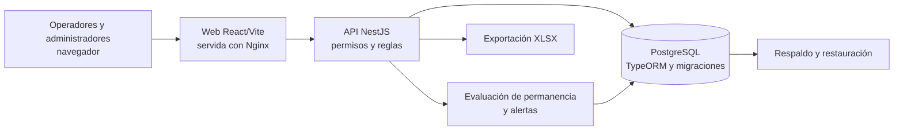

# Etrack Access - arquitectura del MVP Senado

Actualización: 23/09/2026. Versión 0.2. Estado: **stack y responsabilidad de despliegue confirmados por el usuario**; proveedor de hosting, tamaño y reglas operativas aún pendientes. Alcance: [FUNCIONALIDADES.md](FUNCIONALIDADES.md).

## Decisión de stack

El usuario indicó usar el mismo stack tecnológico de MCD-Frontend y MCD-Backend. Se verificó la composición actual de esos repositorios el 23/09/2026, sin asumir que su código de negocio se reutilizará:

| Capa del MVP | Stack confirmado para usar | Evidencia local del stack de referencia |
| --- | --- | --- |
| Interfaz web responsive | React y TypeScript, Vite, React Router, TanStack Query, Tailwind CSS y componentes de interfaz compatibles | [MCD-Frontend/package.json](/Users/matias/Aftercode/MCD-Frontend/package.json), [vite.config.ts](/Users/matias/Aftercode/MCD-Frontend/vite.config.ts) |
| API y reglas | NestJS con TypeScript; autenticación y permisos del servicio, API JSON; programador de tareas de NestJS si se usa para la alerta de permanencia | [MCD-Backend/package.json](/Users/matias/Aftercode/MCD-Backend/package.json) |
| Persistencia | PostgreSQL con TypeORM y migraciones versionadas | [MCD-Backend/package.json](/Users/matias/Aftercode/MCD-Backend/package.json), [data-source.ts](/Users/matias/Aftercode/MCD-Backend/src/database/data-source.ts) |
| Empaquetado y publicación web | Compilación Vite servida por Nginx; API y web en contenedores, base separada | [Dockerfile de frontend](/Users/matias/Aftercode/MCD-Frontend/Dockerfile), [configuración Nginx](/Users/matias/Aftercode/MCD-Frontend/nginx.production.conf.template), [configuración de producción](/Users/matias/Aftercode/MCD-Backend/docker-compose.production.yml) |

Esto fija las **tecnologías y el patrón de capas**. No obliga a copiar módulos, entidades, usuarios ni integraciones de MCD. La versión precisa de cada dependencia se fijará en el nuevo proyecto al iniciar la construcción, tomando un corte compatible y probado del stack.

## Quién despliega y qué recibe Senado

El equipo proveedor debe construir, desplegar y operar la aplicación web, la API y su base de datos durante el piloto. Debe preparar ambiente de pruebas y producción, compilación, migraciones, dominio y HTTPS/TLS, secretos, monitoreo, respaldos y una restauración ensayada. La institución ingresa mediante un enlace desde sus teléfonos, tabletas o computadoras y define los puestos y usuarios autorizados. La frase de la propuesta «sin instalación de programas ni servidores propios» describe **lo que no debe instalar ni alojar Senado**; no elimina el despliegue que debe realizar el proveedor.

El hosting concreto, titularidad de cuentas y dominio, región de datos, retención, RPO/RTO y cobertura de soporte están pendientes de acuerdo. Una referencia de gasto se presenta en [COSTOS_OPERATIVOS.md](COSTOS_OPERATIVOS.md); no determina proveedor ni ubicación aprobada.

## Componentes y datos

**Datos mínimos propuestos:** usuarios y roles; hasta cinco compuertas con estado; movimientos individuales o grupales con cantidad, persona o responsable, observación, ingreso/egreso, hora, compuerta y actor de cada operación; alertas; lecturas ACK; auditoría de cambios administrativos. El grupo confirmado por el usuario guarda responsable y cantidad, sin identidad individual de los integrantes.

**Ingreso y salida.** NestJS valida sesión, permiso y compuerta activa antes de escribir. Una transacción crea el ingreso y una actualización condicional cierra una sola vez el movimiento; debe impedir duplicados y doble egreso bajo concurrencia. Un identificador de solicitud es una propuesta para resolver reintentos tras perder respuesta. El frontend consulta el resultado real antes de mostrar éxito.

**Panel, métricas y exportación.** La API consulta una sola fuente de movimientos. Distingue cantidad de personas de cantidad de registros y aplica la zona horaria de Senado una vez que se confirme. El panel diario está disponible a ambos roles; métricas y XLSX requieren permiso administrador tanto en interfaz como en API. La descarga XLSX es la variante recomendada para abrir en Excel o importar a Sheets; una conexión directa a una cuenta de Sheets sigue pendiente de decisión.

**Alertas.** NestJS persiste la solicitud de asistencia y evalúa movimientos abiertos contra el umbral X configurable. El trabajo programado, si se elige, debe tolerar reinicios y no crear alertas duplicadas. Los clientes conectados consultan la API con una frecuencia ajustada a la demora máxima aceptada; si se exige actualización más inmediata, evaluar un canal en vivo dentro del mismo stack. Cada ACK registra actor y hora. Faltan reglas sobre ACK individual o compartido, repetición y cierre.

**Web y seguridad.** Nginx sirve los archivos estáticos y puede encaminar `/api` al backend, como en el patrón verificado de MCD. HTTPS/TLS debe terminar en el borde de publicación elegido. Credenciales individuales, autorización en NestJS, secretos fuera del código, logs sin exposición innecesaria de documentos y respaldos protegidos son parte de la entrega propuesta. El acceso de soporte y la eliminación final de datos se acordarán con la institución.

## Decisiones y pruebas pendientes

| ID | Estado | Consecuencia |
| --- | --- | --- |
| AD-01 | **Confirmado:** React/TypeScript/Vite/React Router/TanStack Query/Tailwind para la web | La web es responsive y se construye para este MVP. |
| AD-02 | **Confirmado:** NestJS/TypeScript, TypeORM y PostgreSQL para la API y los datos | Definir entidades y contratos según las reglas de Senado. |
| AD-03 | **Confirmado:** el proveedor despliega la web, API y base; Senado usa el enlace | Incluye trabajo y gasto de hosting, dominio/TLS, observabilidad y respaldo. |
| AD-04 | **Propuesto:** frontend compilado en Nginx y API en contenedores, siguiendo el patrón de MCD | Ajustar al proveedor y operación elegidos sin importar la configuración de negocio de MCD. |
| AD-05 | **Propuesto:** web online y consultas periódicas para panel/alertas | Confirmar latencia y contingencia de conectividad. |
| AD-06 | **Pendiente:** proveedor, región, cuentas y recuperación | Puede cambiar infraestructura, costo y cronograma; no cambia el stack decidido. |

| Prueba | Experimento mínimo | Resultado esperado |
| --- | --- | --- |
| Concurrencia | Dos sesiones intentan ingresar la misma identidad o cerrar el mismo movimiento | Un solo estado válido, error claro y aforo consistente. |
| Grupo y cortes | Grupo de N entra, pasa medianoche y sale por otra compuerta | Historial conserva ambas compuertas y N; métricas siguen definiciones aprobadas. |
| Permisos | Operador intenta API y exportación de administrador | NestJS rechaza acciones sin permiso. |
| Red | Cortar conexión antes/después de enviar | Sin confirmación falsa ni duplicado al reintentar. |
| Alertas | Permanencia y asistencia con varias sesiones | Todos ven el aviso dentro del plazo acordado; ACK registra actor/hora. |
| Restauración | Recuperar copia en ambiente aislado | Datos y permisos se reconstruyen dentro de RPO/RTO acordados. |

Son pruebas por ejecutar antes del uso institucional, no resultados ya observados.
