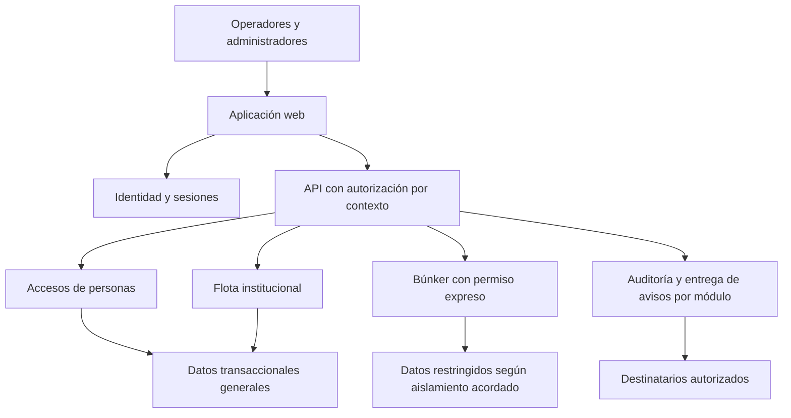

# Etrack Access arquitectura propuesta

Actualización: 22 de septiembre de 2026. Versión 0.4. Estado: desarrollo nuevo y online confirmados; propuesta técnica condicionada por D-03, D-07, D-09 y contexto del equipo D-11. Fuentes técnicas consultadas el 21/09/2026, sin nueva verificación de proveedores en esta actualización documental.

## Recomendación

Usar una aplicación web con módulos de negocio separados, una capa de autorización común y persistencia transaccional. Mantener accesos y flota en una misma solución desplegable. El búnker puede compartir experiencia de acceso, pero su despliegue y custodia dependen del aislamiento requerido. No se justifica repartir todos los módulos en microservicios con la información disponible.

El usuario confirmó construir desde cero una web app online, fuente S2 del 21/09/2026. No hay dependencia de revisión ni reutilización del sistema anterior. Los requisitos canónicos están en [FUNCIONALIDADES.md](FUNCIONALIDADES.md); las decisiones D están en [RELEVAMIENTO.md](RELEVAMIENTO.md).

## Alternativas de implementación

| Alternativa | Ventaja | Costo o límite | Cuándo elegirla |
| --- | --- | --- | --- |
| A Aplicación modular nueva y PostgreSQL administrado | Permite definir límites y transacciones; concentra operación en pocos componentes | Hay que construir identidad, permisos y auditoría con componentes mantenidos | Recomendación inicial si la política institucional admite el proveedor y región. |
| B Aplicación nueva con backend administrado como Supabase | Puede aprovechar identidad y otros servicios comunes | Autorización, movimientos y auditoría siguen requiriendo diseño; mayor dependencia de servicios específicos | Si el equipo valida ventajas reales y los límites de seguridad y recuperación. |
| C Aplicación nueva en infraestructura institucional | Permite adaptar ubicación, redes y custodia | Parches, respaldos, monitoreo, accesos y continuidad necesitan responsables y recursos | Si residencia o confidencialidad impiden la nube propuesta; sigue siendo una web online, sin modo offline. |

La ampliación del Etrack anterior queda descartada por S2. La comparación se concentra en cómo alojar y sostener la nueva aplicación; no reabre la decisión de construir desde cero.

## Componentes y responsabilidades

El esquema describe responsabilidades, no obliga a desplegar un servicio por caja. Si D-03 exige aislamiento fuerte, el búnker tendrá un servicio, credenciales y almacenamiento propios; la API general no debe poseer acceso irrestricto a su contenido.

**Web.** Pantallas de operación, selección de contexto y administración; actualización visible del estado y detección de desconexión. Web app online responsive para escritorio y celulares confirmada por S2 y S5; navegación táctil y formularios/listados adaptados en los flujos incluidos. Sin conexión se bloquean nuevas operaciones y se informa que la situación mostrada puede estar desactualizada.

**API.** Valida identidad, contexto, acción y objeto en cada solicitud; aplica reglas de visitas, grupos, viajes y correcciones. El contexto enviado por el navegador no se considera una autorización.

**Datos.** PostgreSQL es una opción recomendada por las relaciones entre movimientos, puntos y permisos y por la necesidad de transacciones. No es una elección basada en el número de vehículos. La elección definitiva debe confirmarse junto al stack y las capacidades del equipo.

**Avisos y trabajos pendientes.** Registrar el evento y su trabajo de notificación en una transacción; un proceso reintenta entregas y conserva resultado. Una tabla de trabajos puede ser suficiente inicialmente. Evaluar un servicio de cola independiente solo si carga, aislamiento o reintentos lo justifican.

**Auditoría.** Registrar actividad sin copiar indiscriminadamente datos confidenciales en logs técnicos. Separar acceso a auditoría general y del búnker; definir si también se audita la consulta a la propia bitácora. Proteger contra cambios por cuentas de aplicación; resistencia frente a un administrador de infraestructura requiere un diseño adicional.

## Modelo conceptual de datos

| Dominio | Entidades propuestas | Regla importante |
| --- | --- | --- |
| Organización | Institución, establecimiento, punto, habilitación de módulo | Un punto pertenece a una sede; su habilitación por módulo debe ser explícita. |
| Identidad | Usuario, sesión, función, asignación por contexto | Separar configuración, lectura, registro, corrección, exportación y concesión de permisos. |
| Personas | Identidad de visitante, visita, eventos de entrada/salida | No reutilizar una visita cerrada; aplicar unicidad de presencia al circuito acordado. |
| Grupos | Grupo, responsable, visita grupal, integrantes si corresponde | La elección entre cantidad y nómina cambia el control de egresos. |
| Flota | Unidad, conductor/referencia, viaje, eventos | Un movimiento abierto por unidad según RP-03; ubicación inicial explícita. |
| Búnker | Identidad restringida, visita restringida, incidencia y auditoría propias | No vincular automáticamente con búsquedas generales ni deducir presencia a partir de cruces. |
| Incidencias | Categoría, alerta, destinatario, intento de entrega | Mantener alcance y confidencialidad en cada entrega. |

El modelo es conceptual; campos obligatorios, índices y restricciones finales dependen de protocolos. No se propone una única tabla genérica para todos los movimientos, porque personas, flota y búnker tienen reglas y accesos diferentes.

## Decisiones de arquitectura

### ADR-01 Desarrollo desde cero

Estado: confirmado por usuario en S2. Decisión: desarrollar desde cero. Sustituye la propuesta de evaluar reutilización de la versión 0.1. Consecuencia: estimar todo el alcance de la nueva aplicación; no atribuir funcionalidades ya hechas ni ahorro por código anterior. Migración histórica queda fuera hasta que se solicite; la carga inicial de configuración y vehículos sí debe prepararse.

### ADR-02 Aplicación modular y transaccional

Estado: propuesta. Alternativas: aplicación modular, servicios independientes o backend administrado. Recomendación: módulos dentro de una aplicación mantenible por el equipo; PostgreSQL como candidato. Consecuencia: transacciones y operaciones idempotentes para cierres concurrentes; la separación física se reserva a necesidades verificadas. React/Next.js y una API en TypeScript son una opción si coinciden con la experiencia del equipo, no un stack fijado.

### ADR-03 Autorización central y defensa adicional en datos

Estado: propuesta derivada de RF-02 a RF-04 y RF-11. Aplicar mínimo privilegio, denegación por defecto y validación por solicitud, también en reportes y canales de actualización. Es consistente con [OWASP Authorization Cheat Sheet](https://cheatsheetseries.owasp.org/cheatsheets/Authorization_Cheat_Sheet.html), consultada el 21/09/2026.

Evaluar políticas por fila como defensa adicional. PostgreSQL documenta que superusuarios y roles BYPASSRLS evaden esas políticas y que el propietario normalmente también puede hacerlo. Por eso RLS no demuestra aislamiento frente al administrador de base. [Documentación PostgreSQL](https://www.postgresql.org/docs/17/ddl-rowsecurity.html), consultada el 21/09/2026. Es una limitación material para D-03.

### ADR-04 Aislamiento del búnker

Estado: decisión pendiente; no aprobar despliegue definitivo sin D-03 y D-09.

| Nivel | Diseño candidato | Qué protege | Qué no resuelve por sí solo |
| --- | --- | --- | --- |
| L1 Permisos de aplicación | Módulo y tablas/esquema separados, controles en API y datos | Usuarios y administradores funcionales sin permiso de contenido | Acceso privilegiado a base, servidores, backups o secretos. |
| L2 Servicio y credenciales separados | Servicio restringido, base propia, red y copias separadas | Reduce accesos accidentales y el impacto de comprometer la aplicación general | Un administrador con control de ambas infraestructuras puede mantener acceso. |
| L3 Custodia institucional independiente | Cuentas, operadores, claves, despliegue y auditoría bajo separación efectiva de responsabilidades | Exigencias institucionales frente a personal técnico no autorizado | Requiere definir y probar el modelo; cifrado o una base adicional no garantizan confidencialidad absoluta. |

L1 puede cumplir el alcance de visibilidad funcional si la institución acepta ese límite. Si se exige protección frente a infraestructura, evaluar L2 más controles de custodia de L3. Implicaciones: procesos de recuperación, soporte, concedentes y monitoreo también separados. Ningún nivel está aprobado.

### ADR-05 Continuidad y conectividad

Estado: confirmado por usuario en S2. Decisión: operación exclusivamente online. Se descartan registro offline, sincronización local y servidor de sede destinado a seguir operando durante cortes de Internet. Esto reduce la complejidad de coherencia distribuida y almacenamiento sensible en dispositivos.

El servidor es la autoridad sobre permisos y movimientos. Si se pierde conexión, no confirmar nuevas operaciones ni mostrar datos antiguos como actuales. Si el servidor procesó una solicitud pero se perdió la respuesta, consultar su identificador de operación al reconectar; reenviar con el mismo identificador no debe duplicar el movimiento. Esto es tolerancia a errores de red, no un modo offline.

La institución define su contingencia manual y conectividad de respaldo. Al reconectar se revalidan sesión, permisos y estado. No se promete revocar información ya observada o copiada por una persona.

### ADR-06 Despliegue y operación

Estado: propuesta condicionada por D-07. Para nube, comparar plataforma administrada con un despliegue institucional; Render y Supabase son referencias de capacidad y precio, no proveedores elegidos. Desarrollo con datos sintéticos, pruebas separadas de producción, secretos por ambiente y permisos nominales.

Si Render resulta elegible, agrupar servicio y base en la misma región; sus regiones publicadas están en Estados Unidos, Alemania y Singapur. No asumir residencia local. Cambiar región exige migración. [Regiones de Render](https://render.com/docs/regions), consultada el 21/09/2026.

Definir responsable de monitoreo, alertas técnicas, actualizaciones, restauraciones y soporte. Cuentas institucionales con delegación a Aftercode son una propuesta a acordar. TLS, secretos fuera del código y conexiones de base restringidas forman parte del diseño recomendado.

### ADR-07 Respaldo y recuperación

Estado: propuesta. RPO significa pérdida de datos tolerable; RTO, tiempo tolerable de recuperación. Ambos deben ser acordados. Backups disponibles no prueban que esos objetivos se cumplan.

En Render, las bases pagas tienen recuperación a un momento previo; la ventana publicada es de siete días con Pro. La documentación impide seleccionar instantes dentro de los diez minutos más recientes. Un requisito de pérdida casi nula requiere evaluar otra estrategia y verificarla. [Recuperación en Render](https://render.com/docs/postgresql-backups), consultada el 21/09/2026.

Propuesta: copias independientes con retención institucional, acceso restringido, restauración ensayada y registro de resultados. Backups del búnker deben conservar su aislamiento. Alta disponibilidad, archivo histórico y recuperación ante corrupción son necesidades diferentes.

## Pruebas de viabilidad pendientes

| Prueba | Pregunta | Experimento mínimo propuesto | Criterio de éxito |
| --- | --- | --- | --- |
| PV-01 Concurrencia | ¿Se duplica presencia o cierre? | Dos sesiones registran/cerran simultáneamente y repiten una solicitud | Un resultado válido y estado consistente, sin duplicado. |
| PV-02 Aislamiento | ¿Se filtra el búnker por otros caminos? | Usuarios de cada perfil prueban API, búsquedas, contadores, auditoría, avisos y reportes | Ningún dato restringido sale del límite autorizado. |
| PV-03 Revocación | ¿Se invalidan accesos existentes? | Revocar durante sesión y suscripción activa | Se cumple el límite acordado y se registra el cambio. |
| PV-04 Conectividad | ¿Se bloquea y recupera claramente una operación interrumpida? | Cortar Internet antes y después de enviar una solicitud; reconectar y consultar resultado | Sin confirmación falsa, registro offline ni duplicado; permisos revalidados. |
| PV-05 Carga | ¿Soporta los puestos reales? | Simular pico de registros, consultas y actualizaciones con volumen histórico representativo | Se cumplen latencias y errores máximos acordados. |
| PV-06 Recuperación | ¿Se recuperan datos y permisos? | Restaurar copia en entorno aislado y verificar muestras y reglas | Se demuestra el RPO/RTO acordado y la separación del búnker. |

Son pruebas propuestas; no se ejecutaron en esta revisión documental.

## Evolución por señales

| Señal observable | Cambio a evaluar | Consecuencia |
| --- | --- | --- |
| Demoras medidas en registros/consultas | Índices, consultas y conexiones antes de aumentar recursos | Medir mejora y costo; no escalar solo por cantidad de usuarios. |
| Reportes afectan operación | Trabajos diferidos, agregados o réplica de lectura | Mayor infraestructura y datos potencialmente rezagados. |
| Entrega de alertas se atrasa | Separar proceso de avisos y eventualmente cola dedicada | Más monitoreo y recuperación de trabajos. |
| Exigencia de aislamiento más fuerte | Migrar búnker a credenciales y custodia separadas | Migración de datos y rediseño operativo. |
| Instituciones adicionales reales | Revisar aislamiento entre clientes, aprovisionamiento y contratos | Nueva ampliación de producto, no consecuencia automática de multipredio. |
| Caídas exceden tolerancia | Redundancia del servicio o conectividad de respaldo | Comparar costo de continuidad online con impacto operativo; no incorpora modo offline. |

Exportación de datos, migraciones versionadas y una prueba de restauración fuera del proveedor permiten evaluar portabilidad. Usar autenticación o tiempo real propietarios puede aumentar el trabajo de sustitución; documentar ese costo antes de adoptarlos.

Dimensionamiento y rubros recurrentes: [COSTOS_OPERATIVOS.md](COSTOS_OPERATIVOS.md).

## Responsabilidades de implementación y validación

El desglose estimable permanece exclusivamente en [FUNCIONALIDADES.md](FUNCIONALIDADES.md), versión 0.4. Esta tabla enlaza decisiones con responsables; no crea tareas adicionales ni importes.

| Decisión o componente | Propietario en el desglose | Límite para evitar duplicación |
| --- | --- | --- |
| ADR-01 Desarrollo nuevo | Contexto de todas las hojas | Sin crédito de reutilización del sistema anterior; configuración de proyecto en TR-02. |
| ADR-02 Estructura modular y datos | TR-04 contratos; TR-06 base backend; cada RF sus entidades/reglas | Tipo de stack y experiencia pendientes D-11; migración de esquema nuevo no es migración histórica del cliente. |
| Sesión y permisos | RF-02, RF-03 y RF-04 | TR-05 consume estado; las hojas de dominio aplican autorización sin reconstruir motor común. |
| ADR-04 Frontera del búnker | RF-11 a RF-13, más configuración específica de TR-12/TR-13 | L1/L2/L3 alternativas excluyentes; no se estiman garantías de custodia antes de decisión institucional. |
| ADR-05 Online | TR-05 cliente; TR-06 mecanismo y RF transaccionales | Reconexión y consulta de resultado no implican sincronización offline. |
| ADR-06 Despliegue | TR-12 prepara ambientes; TR-15 publica versión validada | Esfuerzo separado de factura mensual; QA usa entorno de pruebas antes del despliegue final, sin dependencias circulares. |
| ADR-07 Recuperación | TR-13 | Incluye ensayo y evidencia PV-06; no repetirlo en QA general. |
| PV-01 y PV-04 | TR-08 | Prueba integrada; cada hoja conserva sus pruebas propias. |
| PV-02 y PV-03 | TR-09 | Validación de seguridad transversal, no una certificación externa incluida. |
| PV-05 | TR-10 | Datos/umbrales por confirmar; hipótesis de consumo no acreditan rendimiento. |

Preparación técnica, revisión, QA y despliegue son trabajo a realizar durante la futura construcción, no acciones ejecutadas al preparar este relevamiento. La web responsive móvil está incluida: TR-03 diseña, TR-05 y hojas web implementan, TR-08 valida escritorio/celulares. Mobile nativo, publicación en tiendas y modo offline siguen excluidos. No se cambian proveedores, niveles de aislamiento ni requisitos aprobados por el solo hecho de completar el desglose.
